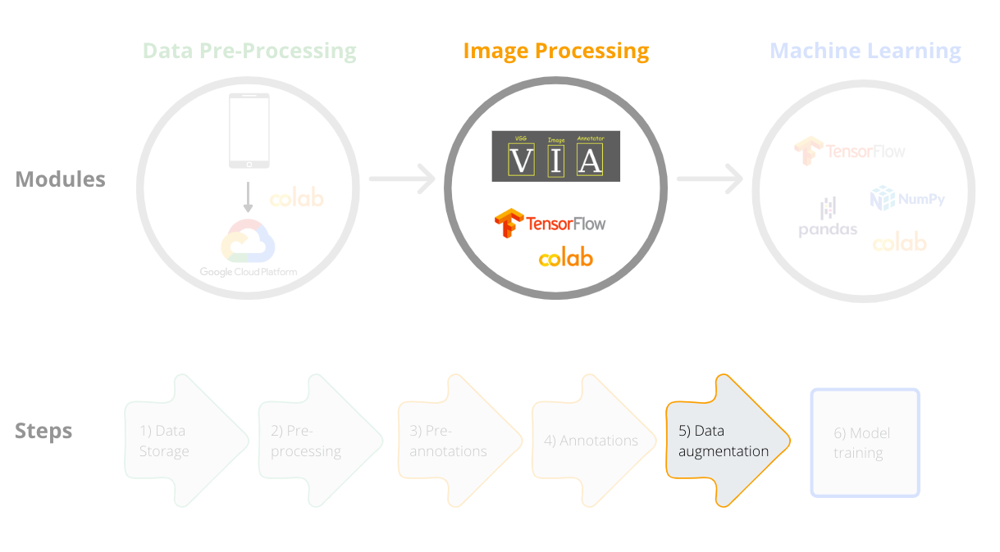
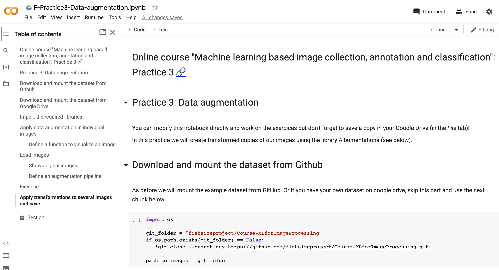

[Course Overview](index.md) \> Practice 3: Data augmentation

# Practice 3: Data augmentation

Framework step 5:

Data augmentation is the process of creating multiple copies of the same images, but with transformations such as flipping, rotating, scaling and cropping. Data augmentations can help reduce overfitting in convolutional neural networks, improve performance, model convergence, generalization and robustness on out-of-distribution samples. You will learn more about overfitting and augmentation in our online meeting or by watching the recorded video.

In this course we will perform data augmentation on our images and save the new images so that in the next practice (classification model training), we will use our images plus the new augmented (or transformed) images.

In this framework we use the open source [Albumentations library](https://albumentations.ai/) for data augmentation. We will first use the function `A.Compose()` from the Albumentations library to define image transformations (for example vertical flips) and then loop over all images in a directory to apply these transformations and save the new images.

Here are **two types** of transformations available in the library (you can find the full list [here](https://albumentations.ai/docs/getting_started/transforms_and_targets/)):

**Catarina, why only two types? There are flips, rotations and so on. Maybe you meant - multiple types of transformations?**

 

You can access the notebook of this practice here (printscreen below):

 

## Resources

Shorten C, Khoshgoftaar TM (2019) [A survey on Image Data Augmentation for Deep Learning](https://journalofbigdata.springeropen.com/articles/10.1186/s40537-019-0197-0). Journal of Big Data, 6.

Mikołajczyk A, Grochowski M (2018) [Data augmentation for improving deep learning in image classification problem](https://ieeexplore.ieee.org/document/8388338). In: 2018 International Interdisciplinary PhD Workshop, IIPhDW 2018, pp. 117--122.

Shorten C, Khoshgoftaar TM (2019) [A survey on Image Data Augmentation for Deep Learning](https://journalofbigdata.springeropen.com/articles/10.1186/s40537-019-0197-0). Journal of Big Data, 6.

Liu S, Papailiopoulos D, Achlioptas D (2020) [Bad global minima exist and SGD can reach them](https://arxiv.org/abs/1906.02613). Advances in Neural Information Processing Systems, 2020-Decem.

Bengio Y, Bastien F, Bergeron A, Boulanger-Lewandowski N, Breuel T, Chherawala Y, Cisse M, Côté M, Erhan D, Eustache J, Glorot X, Muller X, Lebeuf SP, Pascanu R, Rifai S, Savard F, Sicard G (2011) [Deep learners benefit more from out-of-distribution examples](https://proceedings.mlr.press/v15/bengio11b.html). Proceedings of the Fourteenth International Conference on Artificial Intelligence and Statistics, 15, 164--172.

Hendrycks D, Mu N, Cubuk ED, Zoph B, Gilmer J, Lakshminarayanan B (2020) [AugMix: A Simple Data Processing Method to Improve Robustness and Uncertainty](https://arxiv.org/abs/1912.02781). In: Proceedings of the International Conference on Learning Representations (ICLR), pp. 1--15.

Buslaev A, Iglovikov VI, Khvedchenya E, Parinov A, Druzhinin M, Kalinin AA (2020) [Albumentations: Fast and flexible image augmentations](https://arxiv.org/abs/1809.068390). Information, 11, 1--20.
