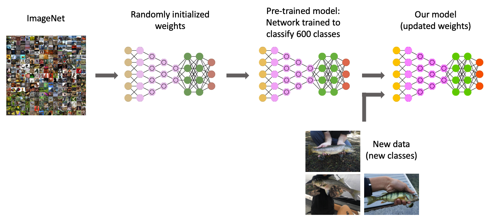

[Course Overview](index.md) > Practice 4: Model training

# Practice 4: Model training

Framework step 6:

 

 
For this practice you need to be familiar with a few concepts that we have not introduced yet.

 

## Transfer learning

**Transfer learning** is commonly defined as a research problem in machine learning that focuses on storing knowledge gained while solving one problem and applying it to a different but related problem. For example, the knowledge gained while learning to recognize fishes could apply when trying to recognize clownfish. 

From a practical point of view, transferring information from a previously learned task (previously trained model) for the learning of new tasks (new models) has the potential to significantly improve efficiency of the learning process.

 

A key challenge with machine learning in general is that we can only know how well our model performs when we test it on new data.
To address this, we can split our initial dataset into separate training and test subsets.

**Training dataset** refers to images used to fit or train the model.

**Test dataset** are the images used to provide an unbiased evaluation of the final model fit and its performance on the training dataset.

**Validation dataset:** are the images used to provide an unbiased evaluation of the model fit on the training dataset while tuning model hyperparameters (i.e. during the process of model training). 

 

 

## Training hyperparameters

 

**Epochs**: refers to one complete pass of the training dataset through the algorithm. More epochs could achieve better accuracy until it converges but training for too many epochs may lead to overfitting (see below). 

If you include all the images in each pass it usually takes only a few epochs for training a model, but, in this scenario, you will need a high amount of computer memory. To overcome this issue, we can break the training data into small batches according to the computer memory or storage capacity. 

**Batch size**: refers to the total number of training examples present in a single batch.

For example if we have 1000 training examples or images in our training dataset we can divide it into batches of 500 then it will take 2 iterations to complete 1 epoch.

 

## Overfitting

In mathematical terms, overfitting can be defined as an analysis that corresponds too closely or exactly to a particular set of data, and may therefore fail to predict future observations. In other words, an overfitted model is unable to generalize to unseen examples (or images).

One evidence that we are likely overfitting is if our model does much better on the training set than on the test set.

<add image>

 

You can access the notebook of this practice here:

 

## Resources

