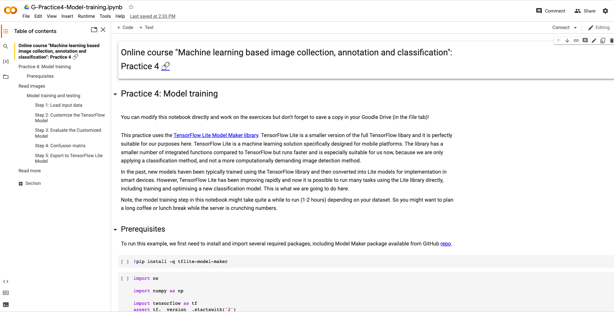

[Course Overview](index.md) \> Practice 4: Model training

# Practice 4: Model training

Framework step 6:

 

 

For this practice you need to be familiar with a few concepts that we have not introduced yet.

 

## Transfer learning

**Transfer learning** is commonly defined as a research problem in machine learning that focuses on storing knowledge gained through solving one problem and applying it to a different but related problem. For example, the knowledge gained while learning to recognize fishes could be applied when trying to recognize clownfish.

From a practical point of view, transferring information from a previously learned task (previously trained model) for the learning of new tasks (new models) has the potential to significantly improve efficiency of the learning process.

 

 

The key general challenge with machine learning is that we can only know how well our model performs when we test it on new data. To address this, we can split our dataset into separate training and test subsets.

**Training dataset** refers to images used to fit or train the model.

**Test dataset** are the images used to provide an unbiased evaluation of the final model fit and its performance on the training dataset.

**Validation dataset:** are the images used to provide an unbiased evaluation of the model fit on the training dataset while tuning model hyperparameters (i.e. during the process of model training).

 

 

## Training hyperparameters

 

**Epochs**: refers to one complete pass of the training dataset through the algorithm. More epochs could achieve better accuracy until it converges but training for too many epochs may lead to overfitting (see below).

If you include all the images in each pass it usually takes only a few epochs to train the model, but you will need a lot of computer memory. To overcome this issue, we can break the training data into smaller batches according to available the computer memory and storage capacity.

**Batch size**: refers to the total number of training examples (photos, in our case) present in a single batch.

**Interations**: corresponds to the number of batches required to complete one epoch. 

For example if we have 1000 images in our training dataset we can divide it into batches of 500 then it will take 2 iterations to complete 1 epoch.

 

## Overfitting

In mathematical terms, overfitting can be defined as an analysis that corresponds too closely or exactly to a particular set of data, and may therefore fail to predict future observations. In other words, an overfitted model is unable to generalize to unseen examples (or images). You might have learned that in statistics. We can fit a polynomial with many parameters to the past data timeseries and such statistical model can fit past observations perfectly. But it will be less likely to predict anything into the future, or, in our machine learning example identify images correctly in a new and different dataset.

One evidence that we are likely overfitting is if our model does much better on the training set than on the test set. You will learn more about this once you complete the workflow in the notebook below.

 

## Accuracy 

Accuracy is a metric used to assess the performance of a model. In simple words, accuracy is the fraction of predictions our model got right. It corresponds to the number of classifications a model correctly predicts divided by the total number of predictions made. For a binary classification (with two classes only), accuracy can be calculated as follows:

Where TP = True Positives, TN = True Negatives, FP = False Positives, and FN = False Negatives.

 

## Loss function

In supervised learning, the mathematical functions that measure how a machine learning model diverges from the truth is called _loss functions_ or _cost functions_. In more general terms, cost functions measure the amount of ‘disagreement’ between the obtained and ideal outputs.

The most common loss function used in classification problems is the **cross-entropy loss** also known as **log-loss**. The values decrease as the predicted probability converges to the actual label. It measures the performance of a classification model whose predicted output is a probability value between 0 and 1.

 

You can access the notebook of this practice here (printscreen below):

 

## Resources

[Hands-on Machine Learning with Scikit-Learn, Keras and Tensorflow 2.0](https://www.oreilly.com/library/view/hands-on-machine-learning/9781492032632/) by Aurelien Geron — O’Reilly. You can also access the open-sourced code from this book [here](https://github.com/ageron/handson-ml2).

 Janocha & Czarnecki (2017) [On Loss Functions for Deep Neural Networks in Classification](https://arxiv.org/abs/1702.05659). arxiv

