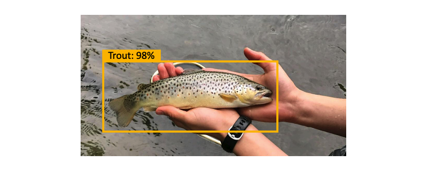

 
  <b>Available in October 2022</b>

In this online course you will learn about:

1. concepts of data science, machine learning (ML), computer vision, deep learning and Convolutional Neural Networks (CNNs)
2. how to pre-process and pre-annotate images to accelerate your ML projects 
3. how to apply data augmentation techniques 
4. how to build an image classification model with your own or example data
  

The online course will be organised as a series of recorded lectures and exercises using Python, combined with a live Q&A session.

The course is led by [Catarina Silva](https://catarinasilva.weebly.com/) (Nature Research Centre, Lithuania) and [Asta Audzijonyte](https://astaaudzi.com/) (Nature Research Centre, Lithuania & University of Tasmania, Australia). 

Participation is free. If you are interested in this course and would like to receive more information about it, please contact us at _info@fishsizeproject.org_

This course is using the framework described in this [publication](https://www.biorxiv.org/content/10.1101/2022.06.29.498112v1.abstract).

 
 

 
  <b>Course overview</b>

A.  Introduction

B.  Concepts of machine learning and computer vision

C.  Intro Practice: Basics of computer vision with Python

D.  Practice 1: Pre-processing images

E.  Practice 2: Images pre-annotation and annotation

F.  Practice 3: Data augmentation

G.  Practice 4: Model training

H.  Conclusion

 

